# Joy For Living Watersports & Activities · Aplicación web de gestión

Aplicación web full-stack construida con **Spring Boot 3 / Java 21** en el back-end y **React 18 + Vite** en el front-end, que digitaliza el mapa de capacidades de la microempresa turística Joy For Living Watersports & Activities.

[](https://github.com/stamperbenjamin7-web/joy-for-living/actions/workflows/ci.yml)

---

## 1. Información del estudiante

| Campo | Detalle |
|---|---|
| **Nombre** | Benjamin Jair Stamper Álvarez |
| **Universidad** | Universidad Técnica Particular de Loja (UTPL) |
| **Carrera** | Tecnología Superior en Transformación Digital de Empresas |
| **Asignatura** | Desarrollo de aplicaciones web |
| **Unidad** | Unidad 3 — Desarrollo de Back-End con Spring y Java |
| **Recurso** | Taller: Desarrollo de una aplicación web en React y Spring |
| **Periodo académico** | *(completar)* |

---

## 2. Información de la empresa

**Joy For Living Watersports & Activities** es una microempresa del sector turístico ubicada en **Noord, Aruba**, dedicada a la operación de experiencias acuáticas para visitantes internacionales: snorkel guiado, kayak transparente en manglares, paddle board, motos acuáticas, buceo y salidas en catamarán al atardecer.

### Situación de partida (AS-IS)

La operación se gestionaba con canales fragmentados: reservas por WhatsApp y correo, agenda en hojas de cálculo compartidas y control de equipamiento en registros manuales. Esto producía sobreventa de cupos, pérdida de trazabilidad de las reservas y ausencia de indicadores para la toma de decisiones.

### Situación objetivo (TO-BE)

Una plataforma única que centraliza el catálogo de experiencias, valida automáticamente la disponibilidad de cupos, mantiene el registro de clientes, controla el inventario de equipamiento y expone indicadores operativos en tiempo real.

---

## 3. Mapa de capacidades

El mapa de capacidades levantado durante el Prácticum 3 y modelado en ArchiMate (Unidad 2) es el que esta aplicación implementa. Las capacidades sombreadas son las que el software cubre directamente.

```mermaid
graph TD
    A[Joy For Living Watersports & Activities]

    A --> B[Gestión comercial]
    A --> C[Operación de experiencias]
    A --> D[Gestión de recursos]
    A --> E[Inteligencia de negocio]

    B --> B1[Catálogo de experiencias]
    B --> B2[Gestión de reservas]
    B --> B3[Gestión de clientes]

    C --> C1[Programación de salidas]
    C --> C2[Control de disponibilidad y cupos]
    C --> C3[Ciclo de vida de la reserva]

    D --> D1[Inventario de equipamiento]
    D --> D2[Control de mantenimiento]

    E --> E1[Indicadores operativos]
    E --> E2[Análisis de demanda por categoría]

    style B1 fill:#17b0bd,color:#06263f
    style B2 fill:#17b0bd,color:#06263f
    style B3 fill:#17b0bd,color:#06263f
    style C1 fill:#17b0bd,color:#06263f
    style C2 fill:#17b0bd,color:#06263f
    style C3 fill:#17b0bd,color:#06263f
    style D1 fill:#17b0bd,color:#06263f
    style D2 fill:#17b0bd,color:#06263f
    style E1 fill:#17b0bd,color:#06263f
    style E2 fill:#17b0bd,color:#06263f
```



### Trazabilidad capacidad → componente de software

| Capacidad de negocio | Módulo de la aplicación | Endpoints |
|---|---|---|
| Catálogo de experiencias | `ActividadService`, pantalla *Experiencias* | `/api/actividades` |
| Gestión de clientes | `ClienteService`, pantalla *Clientes* | `/api/clientes` |
| Gestión de reservas y ciclo de vida | `ReservaService`, pantalla *Reservas* | `/api/reservas` |
| Control de disponibilidad y cupos | `ReservaService.consultarDisponibilidad` | `/api/reservas/disponibilidad` |
| Inventario y mantenimiento de equipamiento | `EquipoService`, pantalla *Equipamiento* | `/api/equipos` |
| Indicadores y análisis de demanda | `ReporteService`, pantalla *Panel* | `/api/reportes/resumen` |

---

## 4. Aplicación objetivo

### Alcance funcional

- **Panel de operaciones.** Ingresos confirmados, reservas por estado, próximas cinco salidas y demanda agrupada por categoría de experiencia.
- **Experiencias.** Alta, consulta y baja lógica del catálogo, con duración, cupo máximo por salida, tarifa por persona y punto de encuentro.
- **Reservas.** Creación con validación de cupos en tiempo real, cálculo automático del importe, código legible (`JFL-XXXXXX`) y transiciones de estado controladas: `PENDIENTE → CONFIRMADA → COMPLETADA`, con cancelación posible desde los dos primeros estados.
- **Clientes.** Registro con correo único y búsqueda por nombre, apellido o correo.
- **Equipamiento.** Inventario con unidades comprometidas frente al total y fecha del último mantenimiento.

### Reglas de negocio implementadas

1. No se puede reservar por encima de la capacidad máxima de la salida. Dos salidas de la misma experiencia se consideran solapadas cuando la diferencia entre sus horas de inicio es menor que la duración de la actividad.
2. Las reservas canceladas no consumen cupo.
3. El importe se calcula como `precio por persona × número de personas`.
4. Una reserva `CANCELADA` o `COMPLETADA` es terminal: no admite más transiciones.
5. Las unidades disponibles de un equipo nunca pueden superar el total registrado.
6. Retirar una experiencia del catálogo es una baja lógica, para preservar el histórico de reservas.

### Arquitectura

```
┌──────────────────────────────────────────────────────────────┐
│  Navegador                                                   │
│  React 18 + Vite + React Router                              │
└───────────────────────────┬──────────────────────────────────┘
                            │  fetch → /api
┌───────────────────────────▼──────────────────────────────────┐
│  Spring Boot 3.3 (Java 21)                                   │
│  Controller  →  Service (reglas de negocio)  →  Repository   │
│  Bean Validation · Manejo global de errores · OpenAPI        │
└───────────────────────────┬──────────────────────────────────┘
                            │  Spring Data JPA / Hibernate
┌───────────────────────────▼──────────────────────────────────┐
│  H2 en memoria (perfil dev)   ·   PostgreSQL (perfil prod)   │
└──────────────────────────────────────────────────────────────┘
```

El front-end construido por Vite se copia a `target/classes/static` durante el empaquetado, de modo que **un solo artefacto `.jar` contiene la aplicación completa**.

### Modelo de datos

| Entidad | Atributos principales | Relaciones |
|---|---|---|
| `Actividad` | nombre, categoría, duración, precio, capacidad, punto de encuentro | 1 → N `Reserva`, 1 → N `Equipo` |
| `Cliente` | nombre, apellido, email (único), teléfono, país | 1 → N `Reserva` |
| `Reserva` | código, fecha y hora, personas, total, estado, notas | N → 1 `Cliente`, N → 1 `Actividad` |
| `Equipo` | nombre, tipo, cantidad total y disponible, estado, mantenimiento | N → 1 `Actividad` |

---

## 5. Tecnologías

| Capa | Tecnología |
|---|---|
| Back-end | Java 21, Spring Boot 3.3.4, Spring Web, Spring Data JPA, Bean Validation, Spring Actuator |
| Front-end | React 18.3, Vite 5, React Router 6 |
| Base de datos | H2 (desarrollo), PostgreSQL (producción) |
| Documentación de API | springdoc-openapi (Swagger UI) |
| Construcción | Maven 3.9, frontend-maven-plugin |
| Pruebas | JUnit 5, Mockito, AssertJ |
| Integración continua | GitHub Actions |
| Despliegue | Docker multietapa sobre Railway |

---

## 6. Requisitos previos

- **JDK 21** o superior
- **Maven 3.9+** (o el wrapper `./mvnw`)
- **Node.js 20+** y npm — solo si vas a trabajar el front-end por separado; el empaquetado con Maven descarga su propia copia de Node.

Verifica tu entorno:

```bash
java -version
mvn -version
node -v
```

---

## 7. Instalación y ejecución

### 7.1 Clonar el repositorio

```bash
git clone https://github.com/stamperbenjamin7-web/joy-for-living.git
cd joy-for-living
```

### 7.2 Opción A — Ejecución en un solo comando (recomendada)

Maven construye el front-end, lo empaqueta dentro del JAR y levanta todo:

```bash
mvn clean package
java -jar target/joy-for-living-api-1.0.0.jar
```

Abre **http://localhost:8080**. El perfil `dev` carga automáticamente datos de demostración: cinco experiencias, cuatro clientes, cinco equipos y tres reservas.

### 7.3 Opción B — Desarrollo con recarga en caliente

Dos terminales:

```bash
# Terminal 1 — back-end en el puerto 8080
mvn spring-boot:run -DskipFrontend

# Terminal 2 — front-end en el puerto 5173 con proxy hacia /api
cd frontend
npm install
npm run dev
```

Abre **http://localhost:5173**.

### 7.4 Ejecutar las pruebas

```bash
mvn test
```

Se ejecutan las pruebas unitarias de las reglas de reservas (cálculo de importes, bloqueo por falta de cupos, disponibilidad y transiciones de estado) y la prueba de humo del contexto de Spring.

---

## 8. Uso de la aplicación

| Pantalla | Qué hacer |
|---|---|
| **Panel** | Revisar los indicadores del día y la agenda de próximas salidas. |
| **Experiencias** | Publicar una nueva experiencia con *Publicar experiencia*, o retirar una del catálogo activo. |
| **Reservas** | Elegir cliente, experiencia y horario. La barra de marea muestra los cupos comprometidos antes de confirmar. Desde la tabla se confirma, completa o cancela cada reserva. |
| **Clientes** | Registrar visitantes y buscarlos por nombre o correo. |
| **Equipamiento** | Consultar unidades en uso y fechas de mantenimiento. |

### Herramientas de desarrollo

| Recurso | URL |
|---|---|
| Documentación interactiva de la API | http://localhost:8080/swagger-ui.html |
| Especificación OpenAPI | http://localhost:8080/v3/api-docs |
| Consola H2 (perfil dev) | http://localhost:8080/h2-console — JDBC `jdbc:h2:mem:joyforliving`, usuario `sa`, sin contraseña |
| Estado del servicio | http://localhost:8080/actuator/health |

### Ejemplos de consumo de la API

```bash
# Catálogo de experiencias
curl http://localhost:8080/api/actividades

# Cupos disponibles de una experiencia en un horario
curl "http://localhost:8080/api/reservas/disponibilidad?actividadId=1&fechaHora=2026-08-15T09:00:00"

# Crear una reserva
curl -X POST http://localhost:8080/api/reservas \
  -H "Content-Type: application/json" \
  -d '{"clienteId":1,"actividadId":1,"fechaHora":"2026-08-15T09:00:00","numeroPersonas":2,"notas":"Primera vez"}'

# Confirmar una reserva
curl -X PATCH "http://localhost:8080/api/reservas/1/estado?valor=CONFIRMADA"

# Indicadores del panel
curl http://localhost:8080/api/reportes/resumen
```

---

## 9. Integración continua y automatización de la construcción

El repositorio incluye un flujo de trabajo de GitHub Actions (`.github/workflows/ci.yml`) que se dispara en cada `push` y cada *pull request* sobre `main`:

1. **Descarga del código** y preparación de JDK 21 y Node 20, con caché de dependencias de Maven y npm.
2. **Construcción del front-end** (`npm install` + `npm run build`).
3. **Compilación y pruebas del back-end** (`mvn verify`).
4. **Publicación de artefactos**: el reporte de pruebas y el `.jar` ejecutable quedan disponibles para descarga desde la ejecución del flujo.

La automatización del empaquetado se apoya en `frontend-maven-plugin`: durante la fase `generate-resources`, Maven descarga Node, instala las dependencias del front-end y ejecuta la construcción de Vite; luego `maven-resources-plugin` copia `frontend/dist` a `target/classes/static`. El resultado es un único artefacto desplegable, sin pasos manuales.

---

## 10. Despliegue en Railway

**Aplicación desplegada:** *(pegar aquí la URL que entregue Railway, por ejemplo `https://joy-for-living-production.up.railway.app`)*

Pasos:

1. Crear un proyecto en [railway.app](https://railway.app) y elegir **Deploy from GitHub repo**, seleccionando este repositorio.
2. Añadir el servicio **PostgreSQL** desde *New → Database → Add PostgreSQL*.
3. En el servicio de la aplicación, sección **Variables**, definir:

   | Variable | Valor |
   |---|---|
   | `SPRING_PROFILES_ACTIVE` | `prod` |
   | `JDBC_DATABASE_URL` | `jdbc:postgresql://${{Postgres.PGHOST}}:${{Postgres.PGPORT}}/${{Postgres.PGDATABASE}}` |
   | `PGUSER` | `${{Postgres.PGUSER}}` |
   | `PGPASSWORD` | `${{Postgres.PGPASSWORD}}` |

4. Railway detecta el `Dockerfile` y construye la imagen multietapa. La variable `PORT` la inyecta la plataforma y la aplicación la lee automáticamente.
5. En *Settings → Networking*, generar el dominio público y copiarlo en este README.

El *healthcheck* configurado en `railway.json` apunta a `/actuator/health`.

---

## 11. Estructura del proyecto

```
joy-for-living/
├── .github/workflows/ci.yml         Flujo de integración continua
├── Dockerfile                       Imagen multietapa para Railway
├── railway.json                     Configuración de despliegue
├── pom.xml                          Construcción unificada back + front
├── frontend/                        Aplicación React
│   ├── src/
│   │   ├── components/              Marea, Distintivo, Olas
│   │   ├── pages/                   Panel, Experiencias, Reservas, Clientes, Equipos
│   │   ├── api.js                   Cliente HTTP del API
│   │   ├── App.jsx                  Rutas y estructura
│   │   └── styles.css               Sistema visual
│   └── vite.config.js
└── src/
    ├── main/java/com/joyforliving/api/
    │   ├── domain/                  Entidades JPA
    │   ├── repository/              Spring Data
    │   ├── service/                 Reglas de negocio
    │   ├── controller/              Endpoints REST
    │   ├── dto/                     Contratos de entrada y salida
    │   ├── exception/               Manejo global de errores
    │   └── config/                  CORS, OpenAPI, datos de demostración
    ├── main/resources/              application.yml, dev y prod
    └── test/java/                   Pruebas unitarias y de contexto
```

---

## 12. Licencia

Proyecto académico desarrollado para la Universidad Técnica Particular de Loja. Uso educativo.
# joy-for-living-app

